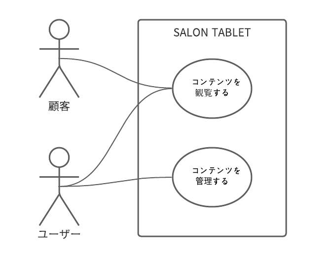
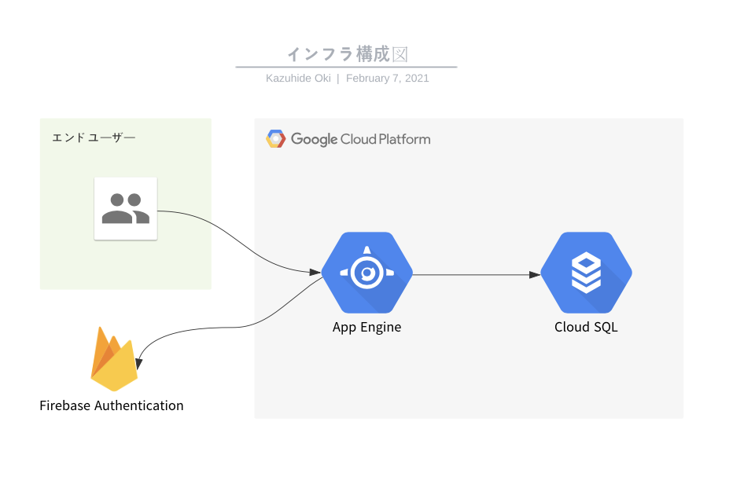

# SALON TABLET とは

美容師と来店顧客のより良いコミュニケーションの手助けをする美容室専用 CMS を提供するウェブサービスです

美容室が抱える以下のような問題を解決します

- 雑誌を読んだり自分のスマートフォンを触って美容室での時間を過ごす顧客に対して、うまく情報発信ができない
- 美容室内で利用するタブレットの中身が雑然としてしまいうまく管理、活用ができない
- 美容室のインテリアと無機質なタブレットがマッチしない

開発者自身が美容師であり職場のタブレットで上記の問題を解決したいと思ったのがきっかけ

## 主な機能

- 記事の読み込み、投稿、編集、削除
- インスタグラムアカウントの連携。投稿の読み込み
- メニュー表、WiFi パスワード、Google 検索などのアイテムの登録
- 開発者へのフィードバックの投稿
- テーマの変更（作成中）
- admin アカウントでサンプル記事やウェブ記事の編集が可能

## 使用技術

- **Typescript** 開発初期では Javascript を利用していたが、コードが増えるたびにエラーも増えてしまった。スムーズでエラーの起こりにくいコードを書けるように導入した  
  'strict'で運用している
- **React** 最初期のプロトタイプはワードプレスと jQuery で作成していたが、画面の動きが複雑になってくるとコードの管理が難しくなり、機能を追加するたびに既存のコードと整合性を取りにくくなった。より管理しやすい、スケールしやすい SPA を作成するために採用した
- **Nextjs** 最初サービス本体のプロトタイプ開発は Create React App で作成していた。これをウェブサイトと連動して管理をするために、そしてバックエンドも同じ言語を利用して開発速度を早めるために導入した。 読み込み時の表示崩れも SSR で改善された
- **Material UI**
  UI に一貫性と保守性を持たせるために導入した。グローバルでデフォルト props を変更することでテーマ変更機能を実装した
- **Storybook**
  UI 開発をコンポーネントごとに見た目、動きをチェックしながら開発できるように導入した。テストしやすくするためにカスタム hooks で DB 由来の初期 props を分けている
- **ESLint, Prettier**
  コードのフォーマット等のために。Typescript と React の recommended の設定でエラーが無くなるまで対応した

- **MySQL** ワードプレスから React アプリへの移行時に自分でデータベースを作る時に導入した。情報が多かったので採用した

- **Firebase + GCP** ワードプレスから React アプリへの移行時のインフラ構成は VPS の Linux サーバーに nodejs と MySQL を稼働させるというものだった。ある時、認証に利用していた npm ライブラリと MySQL が絡む複雑なバグが発生してしまい修復困難となってしまった。そこで、より安定して稼働させるためにインフラ構成を以下のように変更した

- nodejs(Nextjs)のデプロイ先を GCP の App Engine へ
- MySQL は GCP の Cloud SQL へ
- 認証周りの npm ライブラリは Firebase Authentication へ

この移行でそれぞれがより疎結合になり、メンテナスコストが削減された。サービス本体の開発により多くの時間を割けるようになった

- **Github Actions** テストやデプロイの自動化のために導入した。こちらも開発効率アップに貢献した

## ユースケース図

## ER 図

## インフラ構成図

