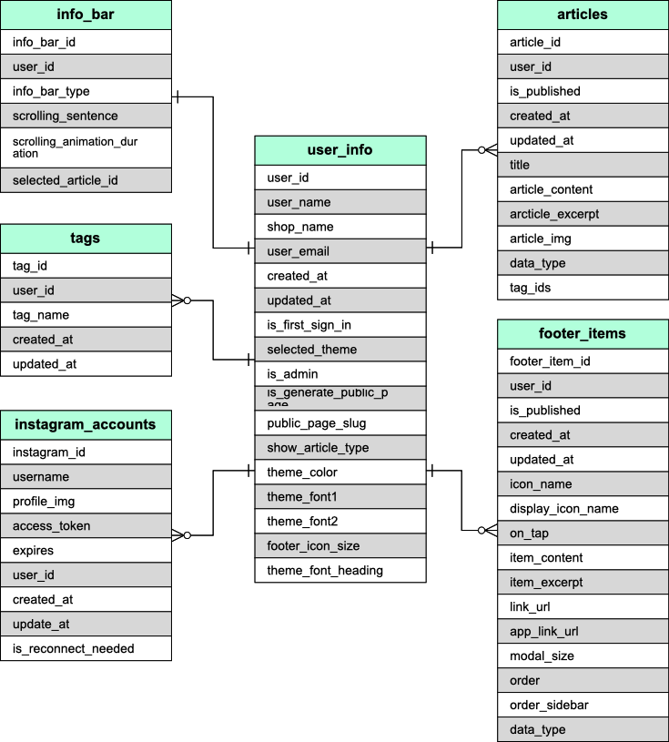

## SALON TABLET とは

美容室、タブレット専用ウェブサービスです。

サインイン後、ホーム画面に追加して利用します。

以下の機能を有しています。

- 記事の読み込み、投稿、編集、削除。
- インスタグラムアカウントの連携。投稿の読み込み
- メニュー表、WiFi パスワード、Google 検索などのアイテムの登録
- 開発者へのフィードバックの投稿
- テーマの変更（作成中）
- admin アカウントでサンプル記事やウェブ記事の編集が可能

## 使用技術

- Typescript
  エラーを減らすために導入。
  'strict'で運用
- React
  サービス本体のシングルページアプリケーション制作のために導入。
- Nextjs
  ウェブサービスとウェブサイトを連動させて構築するために導入。SSR で初期表示の最適化も。
- Material UI
  UI に一貫性と保守性を持たせるために導入。グローバルでデフォルト props を変更することでテーマ変更機能を実装した。
- Storybook
  UI のテスト。テストしやすくするためにカスタム hooks で DB 由来の初期 props を分けている。
- eslint, Prettier
  コードのフォーマット等

- MySQL
  初期のインフラ構成は VPS の LINUX に MySQL インスタンスを直接立ち上げていて、情報が多かったので導入。

- Firebase
  サービスの安定稼働のためにクラウドへ移行。サインイン周りの機能を Firebase Authentication に。
- GCP
  <<<<<<< Updated upstream
  サービスの安定稼働のためにクラウドへ移行。Firebase Authentication と一緒利用するので AWS ではなくこちらを導入。

- Github Actions
  CI/CD のために導入。

## ER 図

## インフラ構成図
